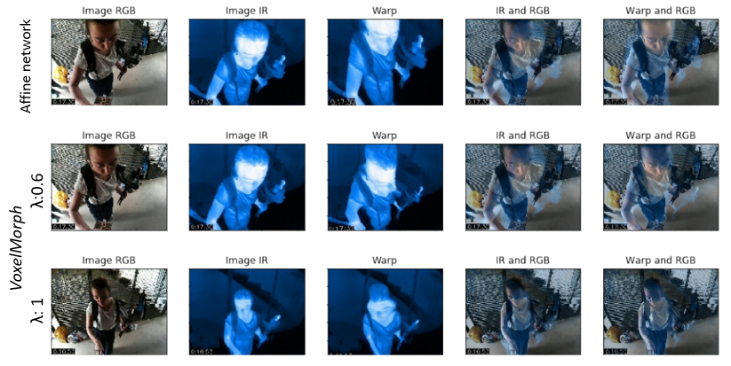

IR-RGB registration with the VoxelMorph architecture and the affine
network. When VoxelMorph (2nd and 3rd row) is trained with λ =
0.6 and λ = 0.1, it poorly deforms the shape of the objects in the
image. When compared visually, the affine network (1st row)
achieves better results.

### Abstract ###
&nbsp;&nbsp;&nbsp;&nbsp;&nbsp;&nbsp; We present a system to perform joint registration and fusion
for RGB and Infrared (IR) video pairs. While RGB is related to
human perception, IR is associated with heat. However, IR images often lack contour and texture information. The goal with
the fusion of the visible and IR images is to obtain more information from them. This requires two completely matched images.
However, classical methods assuming ideal imaging conditions
fail to achieve satisfactory performance in actual cases. From
the data-dependent modeling point of view, labeling the dataset
is costly and impractical.

&nbsp;&nbsp;&nbsp;&nbsp;&nbsp;&nbsp; In this context, we present a framework that tackles two
challenging tasks. First, a video registration procedure that aims
to align IR and RGB videos. Second, a fusion method brings all
the essential information from the two video modalities to a single video. We evaluate our approach on a challenging dataset of
RGB and IR video pairs collected for firefighters to handle their
tasks effectively in challenging visibility conditions such as heavy
smoke after a fire.

#### Publications: ####
* Marouf I.E, Barras L, Karaimer H.C., Süsstrunk S. (2021) "Joint Unsupervised Infrared-RGB Video Registration and Fusion", *London Imaging Meeting* (**LIM`21**), September 2021 [[pdf]](./paper/Joint_Unsupervised_Video_Registration_and_Fusion.pdf) [[bibtex]](./bib/Marouf_Karaimer_LIM21.bib) 

#### Code, Data, and Supplemental Material ####

Please download the code [GitHub](https://github.com/IemProg/Joint_unsupervised_video_registration_and_fusion).   

Please download the supplemental material [[pdf]](./paper/Joint_Unsupervised_Video_Registration_and_Fusion.pdf).

Please download the interactive poster slides [[pdf]](./paper/Joint_Unsupervised_Registration_and_Fusion_LIM2021_Interactive_Paper.pdf).

#### People ####
[Imad Eddine Marouf](https://IemProg.github.io/), 	imad.marouf (at) ip-paris.fr

Lucas Barras, lucas.barras (at) epfl.ch

[Hakki Can Karaimer](https://karaimer.github.io/), 	hakki.karaimer (at) epfl.ch

[Sabine Süsstrunk](https://people.epfl.ch/sabine.susstrunk), 	Sabine.Susstrunk (at) epfl.ch
